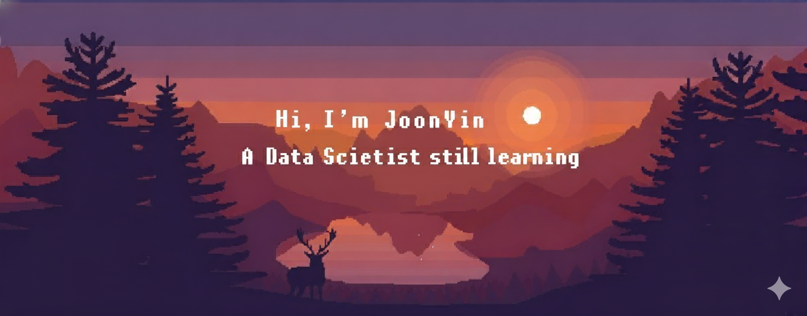

  

<table align="center">
  <tr>
    <td align="center" width="60%">
      <h1 align="center">✨ Hey, I'm Pek Joon Yin</h1>
      
    </td>
    <td align="center" width="40%">
      
    </td>
  </tr>
</table>

---

  
  

  
  

---

### 🧩 About Me
Year 2 Diploma in **AI & Data Analytics** @ *Nanyang Polytechnic*  

---

### 🌐 Connect with Me

  
  
  

